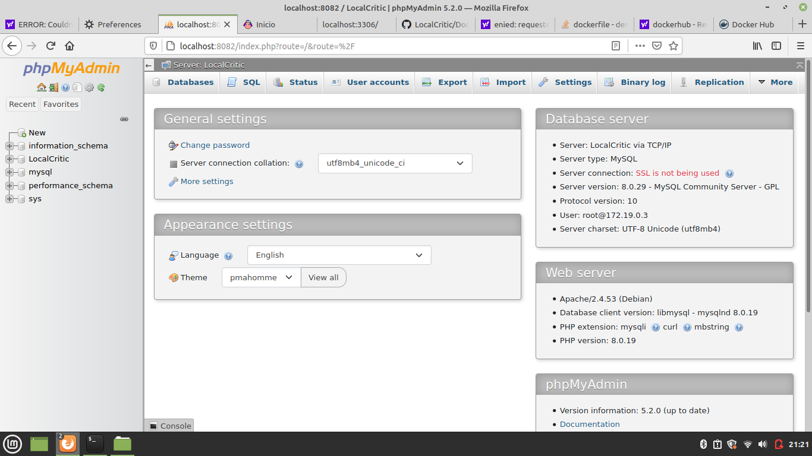

# Autores
Xavier Borrás Mercant
Miguel Marcos Nazco
Antoni Xavier Bascuñana Sánchez
# Instalación del proyecto
1. docker-compose up -d
2. acceder mediante un navegador web la url localhost:3306 (esto ayuda a la conexión en la base de datos)
3. acceder mediante un navegador web la url localhost:8082 e introducir de usuario root y contraseña 1234
4. en esta página seleccionar la base "LocalCritic", irte a la pestaña de import e importar el archivo .sql el mysql-dump
5. acceder a la página web mediante localhost:8080/LocalCritic (esto te llevará a la página de inicio)
# Imágenes

